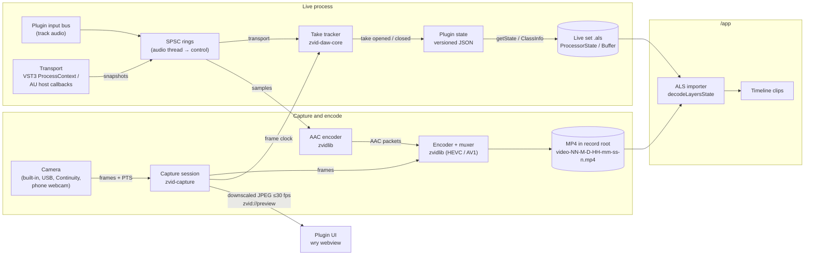
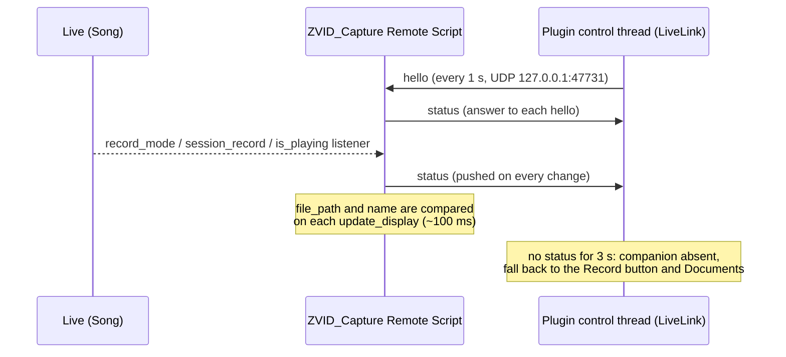

# ZVID Capture: architecture

This document is the source of truth for how the **ZVID Capture** DAW plugin
is built: its goals and constraints, crate layout, threading model, clock
sync, persisted state, the import contract with `/app`, and the decisions
behind them. Implementers of
[#192](https://github.com/lsegal/zvid/issues/192)–[#201](https://github.com/lsegal/zvid/issues/201)
should treat it as the shared reference. The overall effort is tracked in
[#189](https://github.com/lsegal/zvid/issues/189); the UI is specified in
[`daw/DESIGN.md`](DESIGN.md) ([#191](https://github.com/lsegal/zvid/issues/191)).

> **Text and diagrams only.** This doc contains no screenshots and no
> third-party product imagery. Any figure is a fresh mermaid diagram drawn for
> this repository. Keep it that way when editing.

## Goals

1. **Rust only.** The plugin contains no C++ code, does not use the Steinberg
   VST3 SDK, and uses no bindings generated from SDK headers. Allowed:
   - open-source Rust crates with compatible licenses;
   - Apple and Microsoft platform SDKs through Rust FFI crates (`objc2-*`,
     `windows`);
   - VST3 and AU ABI contracts that we rebuild ourselves from public
     documentation.

   CI and `cargo xtask check` fail if a `*.cpp`, `*.cc` or `*.mm` file appears
   under `/daw`.
2. **Product.** A DAW plugin for **Ableton Live 12+** that previews video from
   any active camera the OS exposes. That includes built-in and USB webcams,
   Continuity Camera (iPhone), and Android phone-as-webcam paths such as
   Windows 11 Connected Camera / Phone Link, DroidCam and Camo. All of these
   appear as ordinary capture devices, so the plugin needs no per-vendor code.
3. **Record.** Record arms a capture to a file such as
   `<Documents>/ZVID/Recorded/video-01-6-24-18-47-30-0.mp4`. The container is
   MP4. Video is HEVC or AV1, whichever is easier per platform (see
   [Decisions](#decisions)). Audio is AAC when an encoder is available.
   zvidlib does the encoding and muxing.
4. **Transport-follow takes.** While a capture is armed, each time Live's
   transport starts playing a take opens, and each time it stops the take
   closes. A take is the right-hand portion of the capture file: everything
   before play start is skipped, and the take runs until stop. It is anchored
   to the transport position where play started. Transport changes come from
   the VST3 `ProcessContext` (`kPlaying` state, `projectTimeMusic`,
   `projectTimeSamples`, `systemTime`) or from the AU host callbacks
   (`HostCallback_GetTransportState2`, `HostCallback_GetBeatAndTempo`).
5. **Persisted state.** Each take's transport time, filename, dimensions, fps,
   duration and timestamps are stored in the plugin's saved state, which Live
   embeds in the `.als`. For VST3 the component state becomes
   `<ProcessorState>`. For AU the state goes in the ClassInfo `zvid-state`
   data key, which Live stores as a `<Buffer>` plist.
6. **Portability.** Only filenames relative to the record root are stored,
   never absolute paths, so a set and its footage can move between machines.
7. **Set-relative storage.** When the Live set's directory can be detected,
   captures go to `<set dir>/Recorded/ZVID`. Otherwise they go to
   `<Documents>/ZVID/Recorded`. The set directory comes from the optional
   Live companion script (see
   [Live integration](#live-integration-record-state-and-set-directory)).
8. **Why arming exists.** Live does not reliably report `kRecording` in the
   transport data, so capture can't be tied to Live's record button. The user
   arms capture explicitly and takes follow play/stop. When the optional Live
   companion script is running, Live's own record buttons arm capture instead
   and the plugin's Record button can go away (see
   [Live integration](#live-integration-record-state-and-set-directory)).
9. **UI.** The UI follows the Tauri approach used in `/app`: a web frontend
   (Vite + React + TypeScript, sharing `/app`'s design tokens) hosted by Rust
   in a system webview. Its screens, tokens and components are defined in
   [`daw/DESIGN.md`](DESIGN.md).

## Data flow



## Crate layout

The workspace lives in `/daw` (scaffolded in
[#192](https://github.com/lsegal/zvid/issues/192)).

| Path | Role |
|---|---|
| `daw/crates/zvid-daw-core` | State schema, take tracker state machine, the transport-change watch the format layers share, capture file naming, record-root resolution, and the protocol and client for the Live companion script. Pure (no cameras, hosts or UI; the only I/O is locating Documents and the companion's localhost UDP socket) and unit-tested. |
| `daw/crates/zvid-capture` | Device enumeration, capture sessions, frame timestamps, preview frames, and recording (`record`): frame timing, crash-safe MP4 writing and poster frames, with zvidlib doing all encoding and muxing. AVFoundation on macOS; Media Foundation on Windows. |
| `daw/crates/zvid-daw-ui` | `wry` child-webview host, the IPC bridge to the control thread, and the custom `zvid://` protocol that serves embedded assets and preview frames. The frontend source lives in `daw/ui`. |
| `daw/crates/zvid-vst3` | Hand-written subset of the VST3 COM ABI: the interfaces, IIDs and structs the plugin needs, rebuilt from public documentation. |
| `daw/crates/zvid-au` | AUv2 plugin: the `AudioComponentFactoryFunction` entry point, property and render callbacks, and the Cocoa view factory. |
| `daw/plugin` | The `cdylib` that ties everything together and exports the VST3 and AU entry points. Holds the plugin identity constants. |
| `daw/live-remote-script` | The optional Live companion: a Python MIDI Remote Script (`ZVID_Capture`) that reports Live's record state and set path to plugin instances. Not part of the plugin binary. |
| `daw/xtask` | `cargo xtask`: bundles the `cdylib` into `.vst3` and `.component` (release bundles are universal on macOS and commit-stamped; see [CI builds](#ci-builds)), runs `check` (Rust-only rule, zvidlib rev matches `app/export-bridge`), runs the host integration tests (`host-test`), and runs pluginval (`validate`; see [Testing](#testing)). |

Dependencies point inward: `plugin` depends on everything; `zvid-vst3`,
`zvid-au`, `zvid-capture` and `zvid-daw-ui` depend on `zvid-daw-core` where
they need shared types; `zvid-vst3` and `zvid-au` also depend on
`zvid-daw-ui` to host the editor in their views; `zvid-daw-core` depends on
nothing plugin-specific.

## Threading model

Each plugin instance runs on four kinds of thread. Only the control thread
owns mutable plugin state.

| Thread | Owned by | Does | Must not |
|---|---|---|---|
| **Audio** | Host (`IAudioProcessor::process` / AU render) | Copies a transport snapshot and the input-bus samples into preallocated lock-free SPSC rings (e.g. `rtrb`). Each block of samples carries its host time and sample rate. Passes audio through unchanged. | Allocate, lock, block, log or do I/O. If a ring is full, drop the data and count the drop. |
| **Control** | Plugin (one per instance) | Drains the rings, runs the `TakeTracker`, turns take events into `Recording` entries, arms/disarms capture, and publishes state snapshots. | Block on capture, encode or UI work. |
| **Capture / encode** | Plugin and platform (AVFoundation dispatch queue, Media Foundation source reader) | Receives frames, stamps them, feeds zvidlib and the AAC encoder, writes the MP4, and produces downscaled preview JPEGs. Reports the frame clock to the control thread. | Touch plugin state directly. |
| **UI / host main** | Host | Hosts the webview, answers IPC, and serves `zvid://`. Also where hosts call get/set state. | Talk to anything but the control thread. |

The UI talks only to the control thread, over channels. Commands (arm,
disarm, choose camera) go in; state snapshots and status come out. Host
get/set state calls read the latest published snapshot, or send the loaded
state to the control thread, so they never wait on capture or encode.

## Clock sync

Takes are only useful if they line up with the arrangement. The target is
**±1 video frame** between where a take is placed and where it was shot.

1. **One monotonic clock.** Everything is expressed on the platform's
   monotonic host clock: `mach_absolute_time` on macOS and
   `QueryPerformanceCounter` (QPC) on Windows. Capture presentation timestamps
   already use it (AVFoundation's host time clock; Media Foundation sample
   times on QPC), or are converted to it. `zvid_daw_core::clock::now_sec`
   and `zvid_capture::HostTime` read it the same way.
2. **Transport time.** For each process block the audio thread records when
   the block's song position applies:
   - VST3: the clock read at the start of the process callback.
     `ProcessContext::systemTime` is logged but not used, because VST3 does
     not say which clock it is on.
   - AU: the render `AudioTimeStamp`'s `mHostTime` when valid; otherwise the
     clock read at the start of the render callback.

   The input-audio tap (`zvid_daw_core::tap`) stamps each block's first
   frame with that same time, alongside the block's sample rate, so recorded
   audio is on the clock the takes are.

   No latency correction is applied yet. The plugin reports zero latency in
   both formats, so it has no latency of its own to correct for, and neither
   format tells it the audio device's output latency. What's left is the
   time between processing a block and hearing it: about one buffer, 10 ms
   at 512 samples and 48 kHz, well under one frame at 30 fps. The clap test
   in the [Live 12 end-to-end checklist](#live-12-end-to-end-checklist)
   confirms this or adds a stated correction term here.
3. **File time.** The capture thread reports `FrameClock { host_time,
   file_sec }` pairs: a frame captured at `host_time` was written at
   `file_sec` in the MP4. The tracker maps any host time to file time using
   the latest pair. Before the first frame arrives it counts from the arm
   time.

   In the recorder (`zvid_capture::record`), file time zero is the first
   frame's host time. Video is constant frame rate at the camera's rate:
   each frame takes the nearest free slot of the frame grid no more than one
   frame after it was captured, or is dropped, and a missed slot lengthens
   the frame before it. Audio blocks carry the host time of their first
   sample, are written back to back, and get silence inserted or samples
   skipped only when they drift more than 10 ms from the capture clock, so
   A/V stays within one frame however far the audio device's clock wanders.
4. **Take bounds.** A take's `fileOffsetSec` is the file time at the play
   edge, and `durationSec` is the file time at the stop edge minus that
   offset. Its anchor is the transport position at the play edge
   (`transportStartSec`, `transportStartBeats`, tempo, time signature).
5. **Jumps.** While playing, if the song position moves more than 50 ms away
   from where the host clock says it should be (loop wrap or locate), the
   current take closes and a new one opens (`JUMP_TOLERANCE_SEC` in
   `zvid-daw-core`).

If measurement in [#198](https://github.com/lsegal/zvid/issues/198) or the
[Live 12 end-to-end checklist](#live-12-end-to-end-checklist) shows a residual offset
beyond one frame, fix it here with a stated correction term rather than in
the importer.

## State schema

The persisted state is versioned JSON. It uses the same key names as the
Layers-style `ProcessorState`, so `/app`'s `decodeLayersState` keeps working.
It is implemented by `State` and `Recording` in `zvid-daw-core`.

```jsonc
{
  "version": "1",
  "plugin": "zvid-capture",
  "recordRoot": "project" | "documents", // the latest capture's root
  "recordings": [{
    "id": "uuid",
    "filename": "video-01-9-25-20-36-12-0.mp4", // relative to the record root
    "recordRoot": "project",    // this take's root; absent in older states
    "dimensions": [1920, 1080],
    "fps": [30, 1],
    "frameStart": 915,          // arrangement frame of file frame 0 (Layers-compatible)
    "fileOffsetSec": 1.5,       // seconds into the file where playback started
    "transportStartSec": 32.0,  // Live song time at play start; null if unanchored
    "transportStartBeats": 64.0,
    "durationSec": 36.2,
    "tempo": 120, "timeSignature": [4, 4],
    "camera": "FaceTime HD Camera",
    "createdAt": "2026-09-25T20:36:12Z"
  }],
  "camera": { "id": "0x1420000046d0893", "name": "Logitech BRIO" } // omitted until chosen
}
```

- **One entry per take.** Several entries can share a `filename` when one
  capture file spans several play/stop spans; they differ by `fileOffsetSec`.
- **`frameStart`** is `round(transportStartSec × fps) − round(fileOffsetSec ×
  fps)`, with `fps` as the `[numerator, denominator]` fraction. In the example
  that is `960 − 45 = 915`: file frame 0 sits 1.5 s before the take's
  arrangement position. It can be negative when a take starts near the top of
  the arrangement.
- **Unanchored captures** (armed and disarmed without playback) have
  `transportStartSec`, `transportStartBeats`, `tempo` and `timeSignature` set
  to `null`, `fileOffsetSec: 0`, and a `durationSec` covering the whole file.
  `frameStart` is `0` and meaningless for them.
- **`createdAt`** is an RFC 3339 UTC timestamp.
- **`recordRoot`** is kept per entry: the root the take's capture armed
  with (see [Record root](#record-root)). The top-level `recordRoot` is the
  latest capture's root. Entries without their own `recordRoot`, written
  before roots were kept per entry, are relative to the top-level one.
- **Written as the take happens.** The control thread's `TakeLog`
  (`zvid-daw-core`) appends a take to `recordings` when it opens and keeps
  its `durationSec` running with each transport snapshot until it closes. A
  set saved mid-take therefore still lists the take. Each time a take opens
  or closes, the plugin tells the host its state changed: VST3 through
  `IComponentHandler2::setDirty` (or `restartComponent(kParamValuesChanged)`
  when the host lacks it), AU through a `kAudioUnitProperty_ClassInfo`
  property-change notification.
- **Take IDs** are the capture file's name without `.mp4`, plus
  `-take-N`, where `N` counts that capture's takes from 1.
- **Capture layer commands.** The editor backend
  (`zvid_capture_plugin::backend`, #223) drives the take log through the
  format layer's `commands()` channel. It sends `Arm` with the capture
  file's name, size, frame rate, camera and `createdAt` when recording
  starts, `FrameClock` as frames are written, and `Disarm` when it stops.
  The control thread applies these commands and the transport snapshots in
  host-time order, and publishes each take that opens or closes to the
  format layer's `take_changes()` receiver, which the backend turns into
  `takeOpened` and `takeClosed` events.
- **Capture audio.** The backend takes the format layer's input-audio tap
  (`take_audio_tap()`) when it starts. Each capture records AAC at the bus's
  sample rate at arm time, and gets the blocks tapped while it is armed, with
  their host times. A block at another sample rate is dropped until the next
  capture. Without a tap, or before the host has processed any audio, a
  capture is video only.
- **One backend per instance.** The format crates can't name the backend,
  so the plugin binary registers it with `zvid_daw_ui::register_backend`
  from `GetPluginFactory` and the AU factory. The VST3 `Component` and AU
  `AudioUnitInstance` start it from a `HostLink` (state, `commands()`,
  `take_changes()`, the host dirty notification, the Documents record root
  and the instance's shared Live companion status) when
  their first editor opens, share it across their editors, and shut it
  down when the instance is destroyed. Without a registration, as in the
  format crates' own tests, editors get a `MockBackend`.
- **`camera`** is the camera last chosen in the editor: the capture layer's
  unique device ID and the device name. The backend restores it by ID
  first, then by name, when it starts and whenever the host loads a state
  with a different choice. A camera that isn't connected opens when it is
  plugged in.
- **Forward compatibility.** Unknown keys, at the top level and per recording,
  are kept and written back unchanged, so an older plugin doesn't drop data a
  newer one saved. Additive changes keep `"version": "1"`; a change to the
  meaning of an existing key bumps the version.

### Where hosts keep it

| Format | Plugin side | In the `.als` |
|---|---|---|
| VST3 | The component (`IComponent::getState` / `setState`) writes and reads the UTF-8 JSON bytes. | `<ProcessorState>`, hex-encoded, under the device's `Vst3PluginInfo`. |
| AU | `kAudioUnitProperty_ClassInfo` returns a dictionary with the JSON bytes under the `zvid-state` data key, alongside the standard AU keys. | A `<Buffer>` holding the ClassInfo plist. The exact XML shape is confirmed in [#194](https://github.com/lsegal/zvid/issues/194). |

## Import contract with `/app`

[#199](https://github.com/lsegal/zvid/issues/199) extends the `/app` ALS
importer (`app/src/import/als/`) to read ZVID Capture alongside the existing
Layers Record support. The contract:

1. **Device recognition.** A track is a video track if its device chain holds
   a plugin named **"ZVID Capture"** (VST3 `Vst3PluginInfo` or AU
   `AuPluginInfo`) or **"Layers Record"**. Each known device has its own state
   decoder and clip-matching strategy; Layers Record behavior is unchanged.
2. **Decoding.** VST3 state is the hex JSON in `<ProcessorState>`, decoded as
   `decodeLayersState` does today. AU state is the `zvid-state` key of the
   `<Buffer>` plist. The importer reads the Layers keys (`filename`,
   `dimensions`, `fps`, `frameStart`) plus `fileOffsetSec`,
   `transportStartSec`, `transportStartBeats`, `durationSec`, `recordRoot` and
   `createdAt`.
3. **Clip → take matching.** For each arranged clip on a ZVID Capture track,
   pick the take whose span `[transportStartSec, transportStartSec +
   durationSec)` overlaps the clip's arrangement span the most. On a tie,
   pick the latest `createdAt`. Unanchored takes are never matched. Layers
   Record tracks keep using their last recording.
4. **Placement.** The matched take's `frameStart` is the clip's capture
   offset, exactly as for Layers Record: the file frame shown at arrangement
   frame `f` is `f − frameStart`.
5. **File resolution.** Each take's `recordRoot`, or the state's when the
   take has none, picks the directory: `"project"` resolves `filename`
   against `<als dir>/Recorded/ZVID/`; `"documents"` resolves it against
   `~/Documents/ZVID/Recorded/`. A missing file falls through to the
   existing relink flow.
6. **Source tracks.** Each take becomes its own source-track recording entry.

## Live integration: record state and set directory

VST3 and AU give a plugin neither a reliable record state (Live doesn't
reliably report `kRecording` in the `ProcessContext`) nor the path of the
host's project. [#200](https://github.com/lsegal/zvid/issues/200) evaluated
ways to get both from Live.

### Findings

The Live Object Model's Python bindings were read directly from the Live
executables (their docstrings are compiled in), for Live 11.3.10, 11.3.42 and
12.0.25 on Windows:

- `Song.record_mode` ("Get/Set the state of the global recording flag"),
  `Song.session_record`, `Song.session_record_status` and `Song.is_playing`
  are present in all three. Remote Scripts can observe them with
  `add_<name>_listener`.
- `Song.file_path` ("Get the current Live Set's path on disk") and
  `Song.name` ("Get the current Live Set's name") are present in 11.3.42 and
  12.0.25 and absent from 11.3.10. They reach Remote Scripts, and Max for Live
  through the same bindings.
- `Application` exposes the version (`get_version_string`) but no document
  path.

| # | Approach | Record state | Set dir | Verdict |
|---|---|---|---|---|
| 1 | Live MIDI Remote Script observing `Song`, reporting over localhost UDP | ✅ LOM listeners on `record_mode`, `session_record`, `is_playing` | ✅ `Song.file_path` (Live 11.3.42+, 12) | **Chosen.** Works in every Live edition, runs inside Live, and needs no extra permissions. A one-time Control Surface setup, and Python rather than Rust, but outside the plugin binary. |
| 2 | Max for Live device with `live.observer` | ✅ | ✅ same property | Rejected. Needs Suite or the Max for Live add-on, and a second device on the track. |
| 3 | `kRecording` plus track-arm heuristics | ❌ | — | Rejected. The baseline #193 measures; not reliable. |
| 4 | macOS Accessibility (`AXDocument` of Live's window) | — | ✅ likely | Rejected. macOS only and needs an Accessibility permission prompt; `Song.file_path` makes it unnecessary. |
| 5 | Windows: Live's window title plus recent files in `Preferences.cfg` | — | ⚠️ | Rejected. The title shows the set name, not its path, and the preferences format is binary and changes between versions. |
| 6 | Autosave, undo or crash-recovery files | — | ⚠️ | Rejected. Indirect, version-dependent, and racy around saves. |

### The companion script



- **Protocol.** JSON datagrams with a version `v`, documented and implemented
  in `zvid-daw-core::live`. The script binds `127.0.0.1:47731`; each plugin
  instance binds its own ephemeral localhost port, so any number of instances
  can listen. The script forgets instances it hasn't heard from in 5 s.
- **Threads.** The script runs on Live's main thread: listeners send
  immediately and `update_display` polls the socket, never blocking. The
  plugin polls its non-blocking socket from the control thread, never from
  the audio thread.
- **Arming.** Capture is armed while either record button is on
  (`recordMode || sessionRecord`). Takes still follow play/stop from the
  plugin transport as described in [Clock sync](#clock-sync); the companion
  only replaces the Record button, not the timing source, since its messages
  arrive up to one UI tick late.
- **Set directory.** Each instance's control thread keeps the latest status
  in a `SharedLiveStatus` the editor backend reads when capture arms.
  `setPath`'s parent picks the record root (see [Record root](#record-root)).
  `null` (unsaved set, or Live older than 11.3.42) or no companion falls back
  to `<Documents>/ZVID/Recorded`.
- **Auto-arming.** Both format layers' control threads poll the link through
  `zvid-daw-ui::LiveControl`, which follows `zvid-daw-core::LiveArming`: a
  record button turning on arms the capture through the instance's backend,
  as the Record button does, and both turning off disarms a capture Live
  armed. A capture armed by hand is left alone while Live's record is off.
  The backend starts as soon as the companion is present, so the camera is
  already previewing and arming only starts the encoder; a failed arm (no
  camera yet) is retried every second while record stays on. When the
  companion goes away, a capture it armed keeps running until the user stops
  it, so no footage is dropped. What the companion reports is logged (set
  `ZVID_DAW_LOG`).
- **Status.** While the companion is connected, the editor replaces its
  Record button with a read-only indicator of Live's record state (see
  `DESIGN.md`, Capture card).

### Record root

`CaptureBackend::arm` resolves the root once per capture with
`RecordRoot::for_capture(live.set_dir(), documents)`:

- **Saved set, companion running:** `<set dir>/Recorded/ZVID`, stored as
  `"recordRoot": "project"`. The importer finds it next to the `.als`.
- **Unsaved set, Live older than 11.3.42, or no companion:**
  `<Documents>/ZVID/Recorded`, stored as `"recordRoot": "documents"`.

The recorder creates the directory. The root is fixed at arm: saving the set
or "Save As" mid-capture doesn't move the file, and the take keeps the root
it was recorded with.

Files are never moved or collected, so each take stores its own
`recordRoot`:

- **An unsaved set that is saved later.** Takes recorded before the save
  keep `"documents"` and stay in `<Documents>/ZVID/Recorded`; takes armed
  after the save get `"project"`. The importer resolves each take against
  its own root, so both still resolve.
- **"Save As" to another folder.** `"project"` takes resolve against the
  `.als`'s current folder, so their files have to come with it. Live's
  "Collect All and Save" doesn't know about `Recorded/ZVID`, so copy that
  folder next to the new set. Otherwise those takes fall through to the
  importer's relink flow, which searches by file name. In the plugin, a
  project take is looked up in the set's current folder, or in the folder
  of the last capture while the companion is absent, and is listed as
  missing when its file isn't there.

## Platform matrix

| | macOS | Windows |
|---|---|---|
| OS | 13 Ventura or later | 10 and 11 |
| Architecture | Universal: arm64 + x86_64 | x64 |
| Formats | VST3 (`.vst3`) and AUv2 (`.component`) | VST3 (`.vst3`) |
| Capture API | AVFoundation (`objc2-av-foundation`) | Media Foundation (`windows`) |
| Webview | WKWebView | WebView2 |
| Video encode | zvidlib: VideoToolbox hardware HEVC, else zvidlib's native HEVC, then AV1 | zvidlib: GPU vendor HEVC (NVENC, Quick Sync, AMF) through Media Foundation, else Microsoft's software HEVC MFT, else zvidlib's native HEVC, then AV1 |
| Audio encode | zvidlib: AudioToolbox AAC-LC | zvidlib: Media Foundation AAC-LC; input other than 44.1 or 48 kHz is resampled to one of them |
| Monotonic clock | `mach_absolute_time` | QPC |

### Camera permission

- **macOS.** The plugin runs inside Live's process, so camera access is
  governed by Live's TCC entry and entitlements, not the plugin's. Live 10 and
  11 already ship `NSCameraUsageDescription` and the
  `com.apple.security.device.camera` and `disable-library-validation`
  entitlements, so in-process AVFoundation capture works and the first capture
  triggers the system prompt for Live. `cargo xtask check-live` confirms a
  Live 12 install has them too (see
  [Signing and notarization](#signing-and-notarization)). The plugin checks
  `AVCaptureDevice` authorization status and shows the camera-error state
  from `DESIGN.md` when access is denied, instead of failing silently.
  Continuity Camera requires macOS 13, which sets the minimum.
- **Windows.** Desktop apps need *Settings › Privacy & security › Camera ›
  Let desktop apps access your camera* turned on. When it is off, device
  activation fails and the plugin shows the camera-error state with that
  hint. Windows 11 Connected Camera appears as a normal Media Foundation
  device. Some phone-webcam apps register DirectShow-only virtual cameras that
  Media Foundation does not enumerate; [#196](https://github.com/lsegal/zvid/issues/196)
  confirms each supported app and records any that aren't visible.

## CI builds

Every push to `main` runs the **DAW bundles** workflow
(`.github/workflows/daw-bundle.yml`), which builds two installers:

- `zvid-capture-macos.pkg`: `ZVID Capture.vst3` and
  `ZVID Capture.component`, arm64 + x86_64. CI checks both architectures
  with `lipo -archs`, installs the `.pkg`, verifies the installed bundles'
  signatures and runs `auval` and pluginval against the installed bundles.
- `zvid-capture-windows-setup.exe`: `ZVID Capture.vst3`. CI runs pluginval
  against the bundle, then runs the installer silently, checks the bundle
  was installed, then uninstalls it.

Both jobs also run the [host integration tests](#host-integration-tests)
against the release bundles. On `main`, each then uploads its installer to
the `zvid-downloads` R2 bucket under `capture/`, overwriting the previous
build's, and a final job writes `capture/manifest.json` (version, commit,
build time and each installer's size and SHA-256) once both have. The web
app's Worker serves the bucket at `/downloads`, where **Help › Install
Capture Plugin** links to them. The installer names carry no version; the
version is stamped inside them and in the manifest. Pull request runs
publish nothing.

The desktop app is built first with `pnpm --dir app tauri build` (a
universal `.app` bundle on macOS, `--no-bundle` on Windows), then each
artifact by `cargo xtask bundle --release --installer --app <path>` (plus
`--universal` on macOS), which signs the app like the plugin bundles on
macOS and fails when `daw/ui/dist` is missing rather
than embedding the placeholder UI, and stamps the bundle version
(`Info.plist`, `moduleinfo.json`, the installer and the version reported to
hosts) as `<version>+<sha>`. The same command builds identical bundles
locally once `pnpm --dir daw/ui build` has run; `--universal` needs `rustup
target add aarch64-apple-darwin x86_64-apple-darwin`, and `--installer`
needs Inno Setup 6 on Windows (`ISCC` may name its `ISCC.exe`).

### Installers

- **macOS.** A `.pkg` that installs `zvid.app` into `/Applications`,
  `ZVID Capture.vst3` into `/Library/Audio/Plug-Ins/VST3` and `ZVID Capture.component` into
  `/Library/Audio/Plug-Ins/Components` for every user. It needs macOS 13 and
  runs natively on both architectures. `pkgbuild --compression latest`
  compresses its payload with pbzx (xz) rather than gzip, about 13% smaller.
- **Windows.** An Inno Setup installer (`installer/zvid-capture.iss`) that
  installs `zvid.exe` into `C:\Program Files\ZVID` with a Start menu
  shortcut, installs `ZVID Capture.vst3` into
  `C:\Program Files\Common Files\VST3`, and registers one uninstaller for
  both under *Settings › Apps*. Installing over an older version, including
  an older plugin-only installer, replaces the whole bundle. The app needs
  the Microsoft Edge WebView2 Runtime, which Windows 11 includes but some
  Windows 10 machines lack. When the runtime's registry key is missing, setup
  downloads Microsoft's Evergreen bootstrapper after installing the files and
  runs it silently, so `/VERYSILENT` installs get it too. If that fails, as
  offline, setup still finishes, since the plug-in doesn't need the runtime,
  logs the error and says where to download it (a message box that
  `/SUPPRESSMSGBOXES` suppresses). Uninstalling leaves the runtime, which
  other apps share.

Neither installs the Live companion Remote Script, which lives in each user's
Live User Library. Instead each bundle carries a copy in
`Contents/Resources/ZVID_Capture`, and the editor's **Install Live
companion** button copies it into the User Library (`zvid-daw-ui::live_script`);
see [`live-remote-script/README.md`](live-remote-script/README.md#install).

### Signing and notarization

On macOS, `cargo xtask bundle` ad-hoc signs both bundles, which Apple silicon
needs to load them at all. A `--release` build signs them instead with the
Developer ID Application identity in `ZVID_CODESIGN_IDENTITY`, with the
hardened runtime and a secure timestamp. `--installer` signs the `.pkg` with
the Developer ID Installer identity in `ZVID_INSTALLER_IDENTITY` and, when
notary credentials are set, submits it to Apple's notary service, waits for
it to be accepted and staples the ticket. The credentials are a `notarytool
store-credentials` keychain profile in `ZVID_NOTARY_PROFILE`, or an Apple ID,
team ID and app-specific password in `ZVID_NOTARY_APPLE_ID`,
`ZVID_NOTARY_TEAM_ID` and `ZVID_NOTARY_PASSWORD`.

The DAW bundles workflow signs and notarizes when these repository secrets
are set, and otherwise builds ad-hoc signed bundles and an unsigned `.pkg`:

| Secret | Contents |
|---|---|
| `MACOS_DEVELOPER_ID_APPLICATION_P12` | Base64 of the Developer ID Application certificate and key (`.p12`) |
| `MACOS_DEVELOPER_ID_INSTALLER_P12` | Base64 of the Developer ID Installer certificate and key (`.p12`) |
| `MACOS_CERTIFICATES_PASSWORD` | Password of both `.p12` files |
| `APPLE_ID`, `APPLE_TEAM_ID`, `APPLE_APP_SPECIFIC_PASSWORD` | Notary service credentials |

Windows builds are not Authenticode signed, so SmartScreen warns about the
installer until it builds reputation.

The plugin runs in Live's process, so Live's own entitlements decide whether
it can use the camera (see [Camera permission](#camera-permission)). On a Mac
with Live 12 installed, check them with:

```sh
cargo xtask check-live                      # newest /Applications/Ableton Live 12*.app
cargo xtask check-live "/Applications/Ableton Live 12 Suite.app"
```

It fails, naming what's missing, unless Live has `NSCameraUsageDescription`
and the `com.apple.security.device.camera` and
`com.apple.security.cs.disable-library-validation` entitlements. If a Live
release drops them, capture needs the helper-app path from
[#196](https://github.com/lsegal/zvid/issues/196).

### Installing a CI build

Download the newest `main` build from the web app (**Help › Install Capture
Plugin**), or from `/downloads/capture/zvid-capture-macos.pkg` and
`/downloads/capture/zvid-capture-windows-setup.exe` on the deployed site.
Then run the installer:

- **macOS.** Open `zvid-capture-macos.pkg`. An unsigned build's installer is
  blocked by Gatekeeper; Control-click it and choose *Open*.
- **Windows.** Run `zvid-capture-windows-setup.exe`.

Then rescan plugins in the host (in Live, *Settings › Plug-Ins › Rescan*).

To install the bundles by hand instead, copy them to the folders above. On
macOS, clear the quarantine flag the browser adds to an ad-hoc signed build
before a host loads it:

```sh
xattr -dr com.apple.quarantine /Library/Audio/Plug-Ins/VST3/"ZVID Capture.vst3" \
  /Library/Audio/Plug-Ins/Components/"ZVID Capture.component"
```

For Ableton Live, optionally install the companion Remote Script too, with
the plugin's **Install Live companion** button or by hand; see
[`live-remote-script/README.md`](live-remote-script/README.md#install).

### Live 12 end-to-end checklist

Run this with an installed release build in Live 12 for each of macOS VST3,
macOS AU and Windows VST3 before a release:

- [ ] Live scans and loads the plugin.
- [ ] The camera list includes the built-in, USB and Continuity (macOS)
  cameras, plus a Phone Link or DroidCam camera (Windows).
- [ ] Arm, then play/stop three times, then disarm produces three takes, and
  the files land in the expected directory with the expected names.
- [ ] The takes list previews and reveals each file.
- [ ] Save, close and reopen the `.als`; the takes are still listed.
- [ ] Move the set folder (project root); the take paths still resolve.
- [ ] Importing into `/app` places the takes correctly.
- [ ] No audio dropouts at 64-sample buffers while capturing 1080p30.
- [ ] A clap on camera lines up with its sound in the take to within one
  frame (see [Clock sync](#clock-sync)).

## Testing

- **Unit tests** (`cargo test --workspace`) cover the core logic and each
  format layer through its own vtables: `zvid-vst3` against the VST3 ABI,
  `zvid-au` against the AudioUnit selectors.
- **`auval`** validates the `.component` in the `daw` CI job on macOS and in
  the DAW bundles workflow.
- **UI tests** (`pnpm --dir daw/ui test` and `pnpm --dir daw/ui test:web`)
  run the editor frontend in Node and in a browser against the web driver,
  with no Rust build, below.
- **Host integration tests** (`cargo xtask host-test`) load the real bundles
  in a third-party host, below.
- **pluginval** (`cargo xtask validate`) checks both bundles' format
  conformance, below.
- **Live 12** is checked by hand before a release, with the
  [Live 12 end-to-end checklist](#live-12-end-to-end-checklist).

### UI tests and the web driver

The editor frontend in `daw/ui` only talks to Rust through the `zvid://`
protocol (`zvid-daw-ui/src/protocol.rs`), which it reaches with `fetch`. The
**web driver** (`daw/ui/src/web`) answers that protocol inside the page, so
the editor runs in any browser with no plugin, DAW or Rust harness:

- `mock-backend.ts` is a TypeScript port of `MockBackend` (`mock.rs`) and of
  the event log and preview slot (`channels.rs`): the same canned cameras,
  including the two that fail on purpose, the same capture, take and Live
  companion behavior, and the same event cursors, backlog and resync.
  Preview frames are an SVG test pattern instead of JPEG.
- `driver.ts` routes `zvid://ipc`, `zvid://ipc/events` and
  `zvid://preview` requests to it with the same long-polls and status codes
  as `Protocol`. It records `revealTake`, `openPrivacySettings` and
  `installLiveScript` instead of touching the desktop, draws take posters in
  the page, and simulates the transport and Live companion like the harness.
  Take playback isn't served, so previewing a take stops at once.

The Vite dev server (`pnpm --dir daw/ui dev`) starts the driver whenever the
page has no `window.__ZVID__`, i.e. when it is opened in a plain browser
rather than in the harness. Query options pick the platform, the starting
takes and the simulation (see `src/web/start.ts`), and
`window.__ZVID_DRIVER__` exposes the driver to tests and the devtools
console. The production build leaves the driver out, so the plugin never
embeds it.

UI tests use the driver rather than the Rust harness:

- **Unit tests** (`pnpm --dir daw/ui test`, `node:test`) cover the
  frontend's logic, the mock backend, and the IPC client against the
  driver's `fetch`.
- **Browser tests** (`pnpm --dir daw/ui test:web`, Playwright) drive the
  real editor in headless Chromium at its default size through the dev
  server: choosing cameras, recording takes that follow the transport,
  permission and busy errors on macOS and Windows, refreshing devices,
  revealing takes, and following Live's record buttons. Tests move the
  simulated transport and companion through `window.__ZVID_DRIVER__`.

The `test` CI job runs both on Ubuntu and uploads `daw/ui/test-results`
(Playwright traces) when the browser tests fail. To run them locally:

```sh
pnpm --dir daw/ui install
pnpm --dir daw/ui exec playwright install chromium
pnpm --dir daw/ui test:web
```

The Rust side of the protocol keeps its own tests in `zvid-daw-ui`, and the
harness remains the way to check the editor in the real system webviews.
When `mock.rs` or the protocol changes, change the web driver to match.

### Host integration tests

`cargo xtask host-test` builds the debug bundles (`cargo xtask bundle`) and
runs them in [Plugalyzer](https://github.com/CrushedPixel/Plugalyzer), an
open-source (GPL-3.0) command-line plugin host built on JUCE. It tests
`ZVID Capture.vst3` on macOS and Windows and `ZVID Capture.component` on
macOS. For each one it checks:

- **Pass-through.** A deterministic 48 kHz stereo signal (about 2 s of a
  different tone per channel, low-level noise and impulses no block size
  lines up with) is rendered through the plugin at 64-, 512- and 1024-sample
  blocks. The output must match the input sample for sample.
- **Default state.** A fresh instance's state, saved by the host, decodes
  to the default state JSON. VST3 state is JUCE's `VST3PluginState` blob
  with the component stream in JUCE's own base64. AU state is the ClassInfo
  binary property list with the JSON under `zvid-state`.
- **State round trip.** The shared fixture
  (`fixtures/state/zvid-capture-v1.hex`, with two takes and an unknown key)
  goes into the host's own saved blob and is restored into another fresh
  instance. CLI hosts can't save a state they just loaded, so the format
  layers log `restored state: <takes> takes, <bytes> bytes` for the state
  they now hold. The test requires both counts to match the fixture's.

The `daw` CI job runs these against the debug bundles. The DAW bundles
workflow runs them again, on pull requests and on `main`, against the
release bundles it builds (`cargo xtask host-test --bundles target/bundle`),
because those differ in ways a host can notice: optimized code, the
commit-stamped version, universal binaries on macOS, and Developer ID
signing with the hardened runtime when the secrets are set. Both upload
`target/host-test` when the tests fail.

A run fails when the host exits with an error, crashes or runs past 60 s.
It also fails on any `[zvid-vst3]` or `[zvid-au]` line in `ZVID_DAW_LOG`
except `restored state: …`, `live companion: …` and `dropped N transport
snapshots`. Rendering faster than real time outruns the control thread, so
the transport ring dropping snapshots is expected. Plugalyzer never opens
an editor, so the tests need no display and no cameras. A warm run takes
under 10 s.

The host is not vendored or built. `cargo xtask fetch-test-host` downloads
the Plugalyzer release zip pinned by version and SHA-256 in
`xtask/src/host.rs` into `target/test-host`, and refuses one whose checksum
differs. `host-test` fetches it first when it is missing. To run the tests
locally:

```sh
cd daw
cargo xtask host-test
```

`cargo xtask host-test --bundles <dir>` skips the debug build and tests the
`ZVID Capture.vst3` and, on macOS, `ZVID Capture.component` already in
`<dir>`, for example release bundles from `cargo xtask bundle --release`
in `target/bundle`.

On macOS this installs `ZVID Capture.component` into
`~/Library/Audio/Plug-Ins/Components`, where the AudioComponent registry
can find it, replacing any copy already there. Each host run's WAV output,
state blobs, stdout, stderr and plugin log are left in `target/host-test`.
To update Plugalyzer, change `HOST_VERSION` and each asset's `sha256`, from
`gh release view --repo CrushedPixel/Plugalyzer --json assets`.

#### Choosing the host

| Host | Result |
|---|---|
| Plugalyzer 0.5.0 | **Chosen.** Prebuilt, self-contained CLI binaries for macOS (universal, 10 MB zip) and Windows (4 MB zip). They load VST3 and AU. `process` renders WAV to WAV offline at a chosen block size, and `state` saves a fresh instance's state or restores one. It can't save a state it just restored, hence the log line above. Loaded `ZVID Capture.vst3` on Windows and passed audio through sample for sample. |
| Carla 2.5.10 | Rejected. Its releases are a 250 MB Windows zip and a 370 MB macOS dmg of the full GUI host. It has no one-shot offline render: `carla-single` runs a plugin as a live JACK client, and tests would need to script its engine through the Python backend with a real-time driver. That makes sample-exact checks at chosen block sizes impractical. |
| In-repo Rust host | Fallback only. It would reuse the ABI definitions in `zvid-vst3` and `zvid-au`, so it would share their mistakes and miss real hosts' quirks. |

### pluginval

`cargo xtask validate` runs [pluginval](https://github.com/Tracktion/pluginval)
against the built bundles, as the `daw` CI job does on macOS and Windows:

```sh
cd daw
cargo xtask bundle
# macOS only: Audio Units load only from the plug-in folders.
cp -R "target/bundle/ZVID Capture.component" ~/Library/Audio/Plug-Ins/Components/
cargo xtask validate
```

It validates `target/bundle/ZVID Capture.vst3` and, on macOS,
`~/Library/Audio/Plug-Ins/Components/ZVID Capture.component`, or the bundles
named on the command line. pluginval is Tracktion's prebuilt release,
downloaded once to `target/tools` and checked against the SHA-256 pinned in
`xtask`, so nothing is compiled. It runs at strictness level 10, the highest
(5 is the usual host-compatibility bar), with the editor tests;
`--strictness-level <n>` and `--skip-gui-tests` override that locally, but CI
uses neither. Steinberg's VST3 validator isn't run, because it needs a C++
SDK build; the `daw` job in `ci.yml` records why.

## Decisions

Revise a decision only with a stated rationale, recorded here.

| Topic | Decision | Rationale |
|---|---|---|
| Plugin identity | Name **"ZVID Capture"**, vendor **ZVID**. | The `/app` importer keys on the plugin name. |
| VST3 binding | Hand-written minimal COM ABI in `zvid-vst3`. **Not** the `nih-plug`, `vst3-sys` or `vst3` crates. | `vst3-sys` is GPLv3, and the `vst3` crate is generated from SDK headers. Both break the "no SDK" rule. |
| AU flavour | AUv2 (`.component`). | AUv3 needs an app-extension container, and Live loads AUv2 fine. |
| Host integration tests | [Plugalyzer](https://github.com/CrushedPixel/Plugalyzer), a prebuilt release pinned by version and SHA-256, driven by `cargo xtask host-test`. See [Host integration tests](#host-integration-tests). | A real third-party host catches what the ABI unit tests can't. It is a small prebuilt download with an offline WAV render at chosen block sizes, and needs no C++ build. Carla is far heavier and has no offline render. |
| UI tests | A TypeScript web driver in `daw/ui/src/web` answers the `zvid://` protocol inside the page; unit tests and Playwright browser tests run the editor against it. | Testing the UI through the Rust harness means compiling the plugin crates and a native window per run. The frontend only depends on the protocol, so a port of the mock backend tests it in seconds on any OS, in CI's Ubuntu job. The cost is keeping the port in step with `mock.rs`. |
| UI host | `wry` (Tauri's webview layer) attached as a child of the host view (`NSView` / `HWND`). Not the full Tauri runtime. | Tauri wants to own the process and event loop, which a plugin can't do inside a host. `wry` gives us the same webview and IPC model. |
| Frontend assets | Embedded in the binary and served over `zvid://`. | A single-file bundle, with no loose files beside the plugin. |
| Live preview transport | Native capture is the single source. The UI gets downscaled JPEG frames (≤30 fps) over `zvid://preview`. | Avoids opening the camera twice (getUserMedia plus native), and works the same in WKWebView and WebView2. |
| Video codec | **HEVC Main**, encoded by zvidlib: `native_hevc_video_encoder_factory()` with `HardwarePreference::Prefer` picks the platform's hardware encoder and falls back to software itself. `zvid-capture` contains no encoder code; it converts camera frames to BGRA and times the samples zvidlib returns. zvidlib's native HEVC encoder, then its AV1 encoder, are the last resort when nothing takes the camera's size. No B-frames, a keyframe each second. `RecordStats` and the log name the encoder zvidlib chose and whether it is hardware. | HEVC plays natively in QuickTime, WKWebView and `/app`. [#197](https://github.com/lsegal/zvid/issues/197) requires encoding through zvidlib. zvidlib 0.2.0 added hardware HEVC encoding on macOS and Windows, so the in-tree VideoToolbox and Media Foundation encoders that briefly stood in for it were removed in [#228](https://github.com/lsegal/zvid/issues/228). zvidlib's native encoders take about 2.5 s per 1080p HEVC frame, and its AV1 encoder takes greyscale only, so they are not a real-time path. |
| Crash safety | Record to a **fragmented MP4** (one synced `moof`+`mdat` per second), then remux with zvidlib's `Mp4Muxer` into an ordinary MP4 on disarm. | Killing the host mid-capture leaves every complete fragment playable; the finished file has ordinary sample tables and exact gapless AAC metadata. |
| Audio | AAC-LC of the plugin's input bus (the track audio), via zvidlib's `native_aac_audio_encoder_factory()` (AudioToolbox on macOS, Media Foundation on Windows). zvidlib reports the exact priming and padding. Video-only if no encoder is available. | zvidlib wraps the platform AAC encoders rather than shipping its own, and `/app` export uses the same encoder. The track audio doubles as a sync reference. |
| Capture file vs takes | **One MP4 per arm** (Record → Stop capturing). Each transport play→stop span is a **separate take entry** that references the file plus `fileOffsetSec`. When the camera has turned since the file started, the next take starts a **new MP4** in the new orientation, and later takes reference it; a turn mid-take is letterboxed. | Never loses footage between spans, and takes stay individually addressable. An MP4 has one coded size, so each orientation needs its own file. |
| Loop / relocate while playing | A backwards transport jump or a locate ends the current take and starts a new one. | Keeps each take linear on the timeline. |
| Capture with no playback | Stored as an *unanchored* entry (`transportStartSec: null`). Listed in the UI, skipped by the importer. | Footage isn't lost, and nothing is placed on the timeline incorrectly. |
| Filename | `video-{NN}-{M}-{D}-{HH}-{mm}-{ss}-{n}.mp4`. `NN` is a 2-digit per-instance capture counter, the date and time are local time at arm, and `n` is a collision counter starting at 0. | Matches the requested example `video-01-6-24-18-47-30-0.mp4`. |
| Record root | `<set dir>/Recorded/ZVID` when the companion reports a saved set at arm, else `<Documents>/ZVID/Recorded`. The root kind is saved per take as `recordRoot`, and the latest one at the top level. | Portable, and the importer knows where to look for each take, even when a set is saved after recording started. |
| Record state and set path source | An optional Live MIDI Remote Script (`daw/live-remote-script`) reporting `Song.record_mode`, `session_record`, `is_playing` and `file_path` over localhost UDP. Without it, the plugin keeps its Record button and the Documents root. | VST3/AU report neither reliably; the LOM does, in every Live edition, without extra permissions. Max for Live needs Suite; Accessibility and window-title parsing are single-platform and fragile (#200). |
