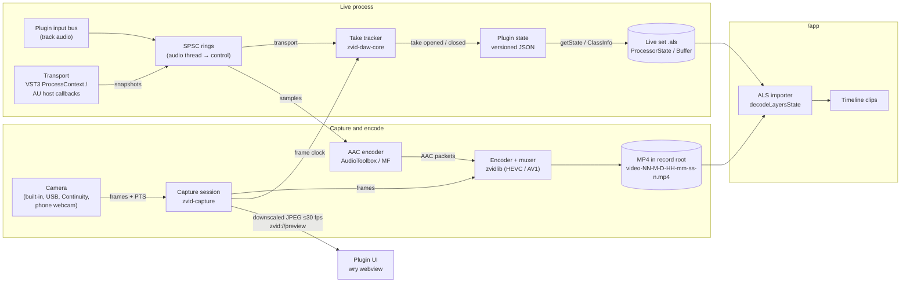
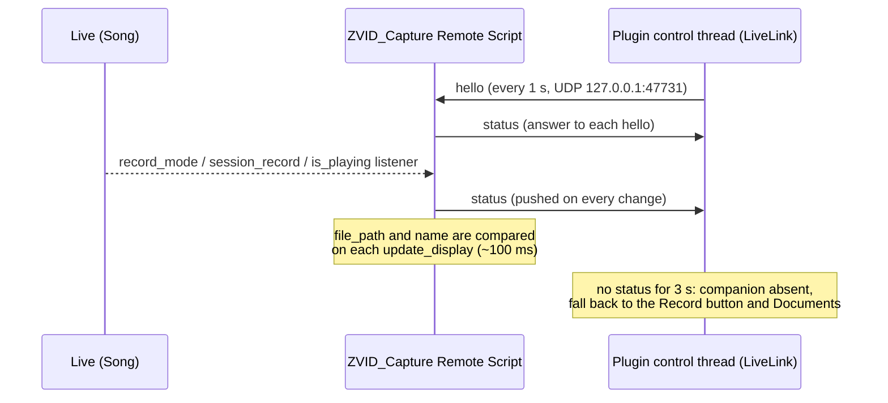

# ZVID Capture: architecture

This document is the source of truth for how the **ZVID Capture** DAW plugin
is built: its goals and constraints, crate layout, threading model, clock
sync, persisted state, the import contract with `/app`, and the decisions
behind them. Implementers of
[#192](https://github.com/lsegal/zvid/issues/192)–[#201](https://github.com/lsegal/zvid/issues/201)
should treat it as the shared reference. The overall effort is tracked in
[#189](https://github.com/lsegal/zvid/issues/189); the UI is specified in
[`daw/DESIGN.md`](DESIGN.md) ([#191](https://github.com/lsegal/zvid/issues/191)).

> **Text and diagrams only.** This doc contains no screenshots and no
> third-party product imagery. Any figure is a fresh mermaid diagram drawn for
> this repository. Keep it that way when editing.

## Goals

1. **Rust only.** The plugin contains no C++ code, does not use the Steinberg
   VST3 SDK, and uses no bindings generated from SDK headers. Allowed:
   - open-source Rust crates with compatible licenses;
   - Apple and Microsoft platform SDKs through Rust FFI crates (`objc2-*`,
     `windows`);
   - VST3 and AU ABI contracts that we rebuild ourselves from public
     documentation.

   CI and `cargo xtask check` fail if a `*.cpp`, `*.cc` or `*.mm` file appears
   under `/daw`.
2. **Product.** A DAW plugin for **Ableton Live 12+** that previews video from
   any active camera the OS exposes. That includes built-in and USB webcams,
   Continuity Camera (iPhone), and Android phone-as-webcam paths such as
   Windows 11 Connected Camera / Phone Link, DroidCam and Camo. All of these
   appear as ordinary capture devices, so the plugin needs no per-vendor code.
3. **Record.** Record arms a capture to a file such as
   `<Documents>/ZVID/Recorded/video-01-6-24-18-47-30-0.mp4`. The container is
   MP4. Video is HEVC or AV1, whichever is easier per platform (see
   [Decisions](#decisions)). Audio is AAC when an encoder is available.
   zvidlib does the encoding and muxing.
4. **Transport-follow takes.** While a capture is armed, each time Live's
   transport starts playing a take opens, and each time it stops the take
   closes. A take is the right-hand portion of the capture file: everything
   before play start is skipped, and the take runs until stop. It is anchored
   to the transport position where play started. Transport changes come from
   the VST3 `ProcessContext` (`kPlaying` state, `projectTimeMusic`,
   `projectTimeSamples`, `systemTime`) or from the AU host callbacks
   (`HostCallback_GetTransportState2`, `HostCallback_GetBeatAndTempo`).
5. **Persisted state.** Each take's transport time, filename, dimensions, fps,
   duration and timestamps are stored in the plugin's saved state, which Live
   embeds in the `.als`. For VST3 the component state becomes
   `<ProcessorState>`. For AU the state goes in the ClassInfo `zvid-state`
   data key, which Live stores as a `<Buffer>` plist.
6. **Portability.** Only filenames relative to the record root are stored,
   never absolute paths, so a set and its footage can move between machines.
7. **Set-relative storage.** When the Live set's directory can be detected,
   captures go to `<set dir>/Recorded/ZVID`. Otherwise they go to
   `<Documents>/ZVID/Recorded`. The set directory comes from the optional
   Live companion script (see
   [Live integration](#live-integration-record-state-and-set-directory)).
8. **Why arming exists.** Live does not reliably report `kRecording` in the
   transport data, so capture can't be tied to Live's record button. The user
   arms capture explicitly and takes follow play/stop. When the optional Live
   companion script is running, Live's own record buttons arm capture instead
   and the plugin's Record button can go away (see
   [Live integration](#live-integration-record-state-and-set-directory)).
9. **UI.** The UI follows the Tauri approach used in `/app`: a web frontend
   (Vite + React + TypeScript, sharing `/app`'s design tokens) hosted by Rust
   in a system webview. Its screens, tokens and components are defined in
   [`daw/DESIGN.md`](DESIGN.md).

## Data flow



## Crate layout

The workspace lives in `/daw` (scaffolded in
[#192](https://github.com/lsegal/zvid/issues/192)).

| Path | Role |
|---|---|
| `daw/crates/zvid-daw-core` | State schema, take tracker state machine, capture file naming, record-root resolution, and the protocol and client for the Live companion script. Pure (no cameras, hosts or UI; the only I/O is locating Documents and the companion's localhost UDP socket) and unit-tested. |
| `daw/crates/zvid-capture` | Device enumeration, capture sessions, frame timestamps, preview frames, and recording (`record`): hardware HEVC and AAC encoding, crash-safe MP4 writing and poster frames, with zvidlib doing the muxing. AVFoundation, VideoToolbox and AudioToolbox on macOS; Media Foundation on Windows. |
| `daw/crates/zvid-daw-ui` | `wry` child-webview host, the IPC bridge to the control thread, and the custom `zvid://` protocol that serves embedded assets and preview frames. The frontend source lives in `daw/ui`. |
| `daw/crates/zvid-vst3` | Hand-written subset of the VST3 COM ABI: the interfaces, IIDs and structs the plugin needs, rebuilt from public documentation. |
| `daw/crates/zvid-au` | AUv2 plugin: the `AudioComponentFactoryFunction` entry point, property and render callbacks, and the Cocoa view factory. |
| `daw/plugin` | The `cdylib` that ties everything together and exports the VST3 and AU entry points. Holds the plugin identity constants. |
| `daw/live-remote-script` | The optional Live companion: a Python MIDI Remote Script (`ZVID_Capture`) that reports Live's record state and set path to plugin instances. Not part of the plugin binary. |
| `daw/xtask` | `cargo xtask`: bundles the `cdylib` into `.vst3` and `.component`, and runs `check` (Rust-only rule, zvidlib rev matches `app/export-bridge`). |

Dependencies point inward: `plugin` depends on everything; `zvid-vst3`,
`zvid-au`, `zvid-capture` and `zvid-daw-ui` depend on `zvid-daw-core` where
they need shared types; `zvid-daw-core` depends on nothing plugin-specific.

## Threading model

Each plugin instance runs on four kinds of thread. Only the control thread
owns mutable plugin state.

| Thread | Owned by | Does | Must not |
|---|---|---|---|
| **Audio** | Host (`IAudioProcessor::process` / AU render) | Copies a transport snapshot and the input-bus samples into preallocated lock-free SPSC rings (e.g. `rtrb`). Passes audio through unchanged. | Allocate, lock, block, log or do I/O. If a ring is full, drop the data and count the drop. |
| **Control** | Plugin (one per instance) | Drains the rings, runs the `TakeTracker`, turns take events into `Recording` entries, arms/disarms capture, and publishes state snapshots. | Block on capture, encode or UI work. |
| **Capture / encode** | Plugin and platform (AVFoundation dispatch queue, Media Foundation source reader) | Receives frames, stamps them, feeds zvidlib and the AAC encoder, writes the MP4, and produces downscaled preview JPEGs. Reports the frame clock to the control thread. | Touch plugin state directly. |
| **UI / host main** | Host | Hosts the webview, answers IPC, and serves `zvid://`. Also where hosts call get/set state. | Talk to anything but the control thread. |

The UI talks only to the control thread, over channels. Commands (arm,
disarm, choose camera) go in; state snapshots and status come out. Host
get/set state calls read the latest published snapshot, or send the loaded
state to the control thread, so they never wait on capture or encode.

## Clock sync

Takes are only useful if they line up with the arrangement. The target is
**±1 video frame** between where a take is placed and where it was shot.

1. **One monotonic clock.** Everything is expressed on the platform's
   monotonic host clock: `mach_absolute_time` on macOS and
   `QueryPerformanceCounter` (QPC) on Windows. Capture presentation timestamps
   already use it (AVFoundation's host time clock; Media Foundation sample
   times on QPC), or are converted to it.
2. **Transport time.** For each process block the audio thread records when
   the block's song position applies:
   - VST3: `ProcessContext::systemTime` when `kSystemTimeValid` is set;
     otherwise the clock read at the start of the process callback.
   - AU: the render `AudioTimeStamp`'s `mHostTime` when valid; otherwise the
     clock read at the start of the render callback.

   That time is corrected for reported latency: the plugin's own reported
   latency and, where the host exposes it, the audio device's output latency,
   so the snapshot describes when the audio at that song position is actually
   heard.
3. **File time.** The capture thread reports `FrameClock { host_time,
   file_sec }` pairs: a frame captured at `host_time` was written at
   `file_sec` in the MP4. The tracker maps any host time to file time using
   the latest pair. Before the first frame arrives it counts from the arm
   time.

   In the recorder (`zvid_capture::record`), file time zero is the first
   frame's host time. Video is constant frame rate at the camera's rate:
   each frame takes the nearest free slot of the frame grid no more than one
   frame after it was captured, or is dropped, and a missed slot lengthens
   the frame before it. Audio blocks carry the host time of their first
   sample, are written back to back, and get silence inserted or samples
   skipped only when they drift more than 10 ms from the capture clock, so
   A/V stays within one frame however far the audio device's clock wanders.
4. **Take bounds.** A take's `fileOffsetSec` is the file time at the play
   edge, and `durationSec` is the file time at the stop edge minus that
   offset. Its anchor is the transport position at the play edge
   (`transportStartSec`, `transportStartBeats`, tempo, time signature).
5. **Jumps.** While playing, if the song position moves more than 50 ms away
   from where the host clock says it should be (loop wrap or locate), the
   current take closes and a new one opens (`JUMP_TOLERANCE_SEC` in
   `zvid-daw-core`).

If measurement in [#198](https://github.com/lsegal/zvid/issues/198) or
[#201](https://github.com/lsegal/zvid/issues/201) shows a residual offset
beyond one frame, fix it here with a stated correction term rather than in
the importer.

## State schema

The persisted state is versioned JSON. It uses the same key names as the
Layers-style `ProcessorState`, so `/app`'s `decodeLayersState` keeps working.
It is implemented by `State` and `Recording` in `zvid-daw-core`.

```jsonc
{
  "version": "1",
  "plugin": "zvid-capture",
  "recordRoot": "project" | "documents",
  "recordings": [{
    "id": "uuid",
    "filename": "video-01-9-25-20-36-12-0.mp4", // relative to the record root
    "dimensions": [1920, 1080],
    "fps": [30, 1],
    "frameStart": 915,          // arrangement frame of file frame 0 (Layers-compatible)
    "fileOffsetSec": 1.5,       // seconds into the file where playback started
    "transportStartSec": 32.0,  // Live song time at play start; null if unanchored
    "transportStartBeats": 64.0,
    "durationSec": 36.2,
    "tempo": 120, "timeSignature": [4, 4],
    "camera": "FaceTime HD Camera",
    "createdAt": "2026-09-25T20:36:12Z"
  }]
}
```

- **One entry per take.** Several entries can share a `filename` when one
  capture file spans several play/stop spans; they differ by `fileOffsetSec`.
- **`frameStart`** is `round(transportStartSec × fps) − round(fileOffsetSec ×
  fps)`, with `fps` as the `[numerator, denominator]` fraction. In the example
  that is `960 − 45 = 915`: file frame 0 sits 1.5 s before the take's
  arrangement position. It can be negative when a take starts near the top of
  the arrangement.
- **Unanchored captures** (armed and disarmed without playback) have
  `transportStartSec`, `transportStartBeats`, `tempo` and `timeSignature` set
  to `null`, `fileOffsetSec: 0`, and a `durationSec` covering the whole file.
  `frameStart` is `0` and meaningless for them.
- **`createdAt`** is an RFC 3339 UTC timestamp.
- **Forward compatibility.** Unknown keys, at the top level and per recording,
  are kept and written back unchanged, so an older plugin doesn't drop data a
  newer one saved. Additive changes keep `"version": "1"`; a change to the
  meaning of an existing key bumps the version.

### Where hosts keep it

| Format | Plugin side | In the `.als` |
|---|---|---|
| VST3 | The component (`IComponent::getState` / `setState`) writes and reads the UTF-8 JSON bytes. | `<ProcessorState>`, hex-encoded, under the device's `Vst3PluginInfo`. |
| AU | `kAudioUnitProperty_ClassInfo` returns a dictionary with the JSON bytes under the `zvid-state` data key, alongside the standard AU keys. | A `<Buffer>` holding the ClassInfo plist. The exact XML shape is confirmed in [#194](https://github.com/lsegal/zvid/issues/194). |

## Import contract with `/app`

[#199](https://github.com/lsegal/zvid/issues/199) extends the `/app` ALS
importer (`app/src/import/als/`) to read ZVID Capture alongside the existing
Layers Record support. The contract:

1. **Device recognition.** A track is a video track if its device chain holds
   a plugin named **"ZVID Capture"** (VST3 `Vst3PluginInfo` or AU
   `AuPluginInfo`) or **"Layers Record"**. Each known device has its own state
   decoder and clip-matching strategy; Layers Record behaviour is unchanged.
2. **Decoding.** VST3 state is the hex JSON in `<ProcessorState>`, decoded as
   `decodeLayersState` does today. AU state is the `zvid-state` key of the
   `<Buffer>` plist. The importer reads the Layers keys (`filename`,
   `dimensions`, `fps`, `frameStart`) plus `fileOffsetSec`,
   `transportStartSec`, `transportStartBeats`, `durationSec`, `recordRoot` and
   `createdAt`.
3. **Clip → take matching.** For each arranged clip on a ZVID Capture track,
   pick the take whose span `[transportStartSec, transportStartSec +
   durationSec)` overlaps the clip's arrangement span the most. On a tie,
   pick the latest `createdAt`. Unanchored takes are never matched. Layers
   Record tracks keep using their last recording.
4. **Placement.** The matched take's `frameStart` is the clip's capture
   offset, exactly as for Layers Record: the file frame shown at arrangement
   frame `f` is `f − frameStart`.
5. **File resolution.** `recordRoot: "project"` resolves `filename` against
   `<als dir>/Recorded/ZVID/`; `"documents"` resolves it against
   `~/Documents/ZVID/Recorded/`. A missing file falls through to the
   existing relink flow.
6. **Source tracks.** Each take becomes its own source-track recording entry.

## Live integration: record state and set directory

VST3 and AU give a plugin neither a reliable record state (Live doesn't
reliably report `kRecording` in the `ProcessContext`) nor the path of the
host's project. [#200](https://github.com/lsegal/zvid/issues/200) evaluated
ways to get both from Live.

### Findings

The Live Object Model's Python bindings were read directly from the Live
executables (their docstrings are compiled in), for Live 11.3.10, 11.3.42 and
12.0.25 on Windows:

- `Song.record_mode` ("Get/Set the state of the global recording flag"),
  `Song.session_record`, `Song.session_record_status` and `Song.is_playing`
  are present in all three. Remote Scripts can observe them with
  `add_<name>_listener`.
- `Song.file_path` ("Get the current Live Set's path on disk") and
  `Song.name` ("Get the current Live Set's name") are present in 11.3.42 and
  12.0.25 and absent from 11.3.10. They reach Remote Scripts, and Max for Live
  through the same bindings.
- `Application` exposes the version (`get_version_string`) but no document
  path.

| # | Approach | Record state | Set dir | Verdict |
|---|---|---|---|---|
| 1 | Live MIDI Remote Script observing `Song`, reporting over localhost UDP | ✅ LOM listeners on `record_mode`, `session_record`, `is_playing` | ✅ `Song.file_path` (Live 11.3.42+, 12) | **Chosen.** Works in every Live edition, runs inside Live, and needs no extra permissions. A one-time Control Surface setup, and Python rather than Rust, but outside the plugin binary. |
| 2 | Max for Live device with `live.observer` | ✅ | ✅ same property | Rejected. Needs Suite or the Max for Live add-on, and a second device on the track. |
| 3 | `kRecording` plus track-arm heuristics | ❌ | — | Rejected. The baseline #193 measures; not reliable. |
| 4 | macOS Accessibility (`AXDocument` of Live's window) | — | ✅ likely | Rejected. macOS only and needs an Accessibility permission prompt; `Song.file_path` makes it unnecessary. |
| 5 | Windows: Live's window title plus recent files in `Preferences.cfg` | — | ⚠️ | Rejected. The title shows the set name, not its path, and the preferences format is binary and changes between versions. |
| 6 | Autosave, undo or crash-recovery files | — | ⚠️ | Rejected. Indirect, version-dependent, and racy around saves. |

### The companion script



- **Protocol.** JSON datagrams with a version `v`, documented and implemented
  in `zvid-daw-core::live`. The script binds `127.0.0.1:47731`; each plugin
  instance binds its own ephemeral localhost port, so any number of instances
  can listen. The script forgets instances it hasn't heard from in 5 s.
- **Threads.** The script runs on Live's main thread: listeners send
  immediately and `update_display` polls the socket, never blocking. The
  plugin polls its non-blocking socket from the control thread, never from
  the audio thread.
- **Arming.** Capture is armed while either record button is on
  (`recordMode || sessionRecord`). Takes still follow play/stop from the
  plugin transport as described in [Clock sync](#clock-sync); the companion
  only replaces the Record button, not the timing source, since its messages
  arrive up to one UI tick late.
- **Set directory.** `setPath`'s parent is passed to `RecordRoot::resolve`.
  `null` (unsaved set, or Live older than 11.3.42) falls back to
  `<Documents>/ZVID/Recorded`.
- **Status.** The prototype in #200 logs what the companion reports (set
  `ZVID_DAW_LOG`). Auto-arming, removing the Record button and resolving the
  record root from the set path are separate follow-ups.

## Platform matrix

| | macOS | Windows |
|---|---|---|
| OS | 13 Ventura or later | 10 and 11 |
| Architecture | Universal: arm64 + x86_64 | x64 |
| Formats | VST3 (`.vst3`) and AUv2 (`.component`) | VST3 (`.vst3`) |
| Capture API | AVFoundation (`objc2-av-foundation`) | Media Foundation (`windows`) |
| Webview | WKWebView | WebView2 |
| Video encode | VideoToolbox HEVC; zvidlib HEVC, then AV1, as software fallbacks | Media Foundation HEVC (GPU vendor MFT, else Microsoft's HEVC Video Extensions); zvidlib HEVC, then AV1, as software fallbacks |
| Audio encode | AudioToolbox AAC-LC (zvidlib's adapter) | Media Foundation AAC encoder |
| Monotonic clock | `mach_absolute_time` | QPC |

### Camera permission

- **macOS.** The plugin runs inside Live's process, so camera access is
  governed by Live's TCC entry and entitlements, not the plugin's. Live 10 and
  11 already ship `NSCameraUsageDescription` and the
  `com.apple.security.device.camera` and `disable-library-validation`
  entitlements, so in-process AVFoundation capture works and the first capture
  triggers the system prompt for Live. Live 12 still needs to be confirmed in
  [#201](https://github.com/lsegal/zvid/issues/201). The plugin checks
  `AVCaptureDevice` authorization status and shows the camera-error state
  from `DESIGN.md` when access is denied, instead of failing silently.
  Continuity Camera requires macOS 13, which sets the minimum.
- **Windows.** Desktop apps need *Settings › Privacy & security › Camera ›
  Let desktop apps access your camera* turned on. When it is off, device
  activation fails and the plugin shows the camera-error state with that
  hint. Windows 11 Connected Camera appears as a normal Media Foundation
  device. Some phone-webcam apps register DirectShow-only virtual cameras that
  Media Foundation does not enumerate; [#196](https://github.com/lsegal/zvid/issues/196)
  confirms each supported app and records any that aren't visible.

## Decisions

Revise a decision only with a stated rationale, recorded here.

| Topic | Decision | Rationale |
|---|---|---|
| Plugin identity | Name **"ZVID Capture"**, vendor **ZVID**. | The `/app` importer keys on the plugin name. |
| VST3 binding | Hand-written minimal COM ABI in `zvid-vst3`. **Not** the `nih-plug`, `vst3-sys` or `vst3` crates. | `vst3-sys` is GPLv3, and the `vst3` crate is generated from SDK headers. Both break the "no SDK" rule. |
| AU flavour | AUv2 (`.component`). | AUv3 needs an app-extension container, and Live loads AUv2 fine. |
| UI host | `wry` (Tauri's webview layer) attached as a child of the host view (`NSView` / `HWND`). Not the full Tauri runtime. | Tauri wants to own the process and event loop, which a plugin can't do inside a host. `wry` gives us the same webview and IPC model. |
| Frontend assets | Embedded in the binary and served over `zvid://`. | A single-file bundle, with no loose files beside the plugin. |
| Live preview transport | Native capture is the single source. The UI gets downscaled JPEG frames (≤30 fps) over `zvid://preview`. | Avoids opening the camera twice (getUserMedia plus native), and works the same in WKWebView and WebView2. |
| Video codec | **HEVC Main** from the platform's hardware encoder (VideoToolbox; a Media Foundation HEVC MFT), implemented in `zvid-capture` behind the same encoder seam. zvidlib's native HEVC, then AV1, encoders are the fallback. No B-frames, a keyframe each second. | HEVC plays natively in QuickTime, WKWebView and `/app`. Revised in [#197](https://github.com/lsegal/zvid/issues/197): zvidlib offers hardware *decoding* only, and its software encoders take about 2.5 s per 1080p HEVC frame (and 80 ms at 320×240), far from real time. Its AV1 encoder also takes greyscale input only. |
| Crash safety | Record to a **fragmented MP4** (one synced `moof`+`mdat` per second), then remux with zvidlib's `Mp4Muxer` into an ordinary MP4 on disarm. | Killing the host mid-capture leaves every complete fragment playable; the finished file has ordinary sample tables and exact gapless AAC metadata. |
| Audio | AAC-LC of the plugin's input bus (the track audio), via AudioToolbox (macOS) or the Media Foundation AAC encoder (Windows). Video-only if neither is available. | zvidlib ships no AAC encoder, and `/app` export already uses AudioToolbox. The track audio doubles as a sync reference. |
| Capture file vs takes | **One MP4 per arm** (Record → Stop capturing). Each transport play→stop span is a **separate take entry** that references the file plus `fileOffsetSec`. | Never loses footage between spans, and takes stay individually addressable. |
| Loop / relocate while playing | A backwards transport jump or a locate ends the current take and starts a new one. | Keeps each take linear on the timeline. |
| Capture with no playback | Stored as an *unanchored* entry (`transportStartSec: null`). Listed in the UI, skipped by the importer. | Footage isn't lost, and nothing is placed on the timeline incorrectly. |
| Filename | `video-{NN}-{M}-{D}-{HH}-{mm}-{ss}-{n}.mp4`. `NN` is a 2-digit per-instance capture counter, the date and time are local time at arm, and `n` is a collision counter starting at 0. | Matches the requested example `video-01-6-24-18-47-30-0.mp4`. |
| Record root | `<set dir>/Recorded/ZVID` when detected, else `<Documents>/ZVID/Recorded`. The root kind is saved as `recordRoot`. | Portable, and the importer knows where to look. |
| Record state and set path source | An optional Live MIDI Remote Script (`daw/live-remote-script`) reporting `Song.record_mode`, `session_record`, `is_playing` and `file_path` over localhost UDP. Without it, the plugin keeps its Record button and the Documents root. | VST3/AU report neither reliably; the LOM does, in every Live edition, without extra permissions. Max for Live needs Suite; Accessibility and window-title parsing are single-platform and fragile (#200). |
